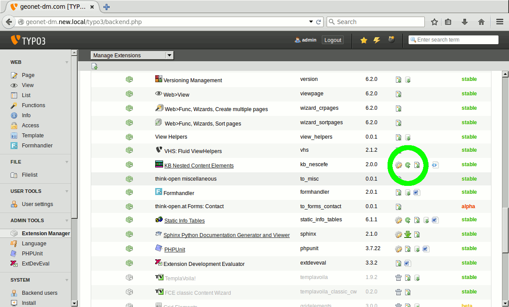
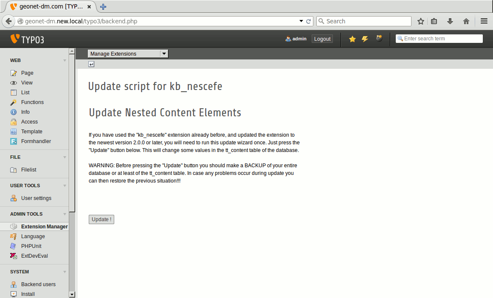


.. ==================================================
.. FOR YOUR INFORMATION
.. --------------------------------------------------
.. -*- coding: utf-8 -*- with BOM.

.. ==================================================
.. DEFINE SOME TEXTROLES
.. --------------------------------------------------
.. role::   underline
.. role::   typoscript(code)
.. role::   ts(typoscript)
   :class:  typoscript
.. role::   php(code)

Update from previous versions
^^^^^^^^^^^^^^^^^^^^^^^^^^^^

If you have used kb\_nescefe before and you upgrade from a previous versions
some precaution has to be taken.

.. warning:: Make sure to have a backup of the site and it's database before trying an upgrade!

An upgrade of an TYPO3 4.5 LTS for example should consist of the following steps:

1. **Upgrade of TYPO3** Just do the normal upgrade of TYPO3 as you would do it with any other site. During upgrade uninstall the old version of kb\_nescefe.

2. **Install new kb\_nescefe version** When the core upgrade is done and your site is up and running again re-install the new version of kb\_nescefe and perform any database changes.

3. **Run the upgrade wizard** When you have installed the new version of kb\_nescefe just run the upgrade wizard script from within the extension manager.

It should be no problem to run the upgrade wizard multiple times. The upgrade to version
2.0.0 has not been tested toroughly because of missing real world examples. If you experience
any problems feel free to contact the extension author for support.

General notes about updating
""""""""""""""""""""""""""""

As this extension already exists since about 8 years quite some changes
in its architecture have been introduced. When upgrading a very old installtion
it could be required to first upgrade to version 1.0.0 of kb\_nescefe using a
TYPO3 4.5 LTS and then do the final upgrade to version 2.0.0. Altough it is
implemented it is not known whether a upgrade of pre 1.0.0. versions directly
to 2.0.0 will work.

Updating to 2.0.0
"""""""""""""""""

Upgrading from a version greater or equal to 1.0.0 to 2.0.0 should usually
work without any glitches. In versions before 2.0.0 the content element field
containing the reference to its parent container was named "parentPosition"
and contained a mixture of a record reference to the parent container and
the specification of the column inside this container element.

In version 2.0.0 this field got split up in to separate fields:
"kbnescefe\_parentElement" and "kbnescefe\_parentPosition". The "parentElement"
field is a simply TCA group field (internal type: db) containing a reference
to the container the element is contained in. The "parentPosition" field
contains a string which describes the position (column) inside the container.
So the "parentElement" field could get compared to the "pid" field of a normal
content element while the "parentPosition" field could get compared to the
"colPos" field of a normal content element.

Updating from 0.0.5 to 1.0.0
""""""""""""""""""""""""""""

When changing version numbers from 0.0.5 to 1.0.0 a change happened,
in the way the extension stores the position of an element within its
parent container. Previously the "colPos" field contained a value
describing in which column in the container an element is located.
This has changed in the new 1.0.0 version, so the colPos field does
not get misused for this purpose any more. Instead a new field called
"parentPosition" got introduced into the tt\_content table. To accommodate
with this change an update wizard got added to the
extension.

Update instructions
"""""""""""""""""""

After updating the extension to the newest version and
performing all required database changes you should use
green-circle-arrow icon "Execute the update script" button
of the extension manager to run the update script.

**Previous version of TYPO3 (the extension manager)**: Use
the drop down found at the top of the Extension Manager when having
selected the "kb\_nescefe" extension. In the dropdown you can find
an item labeled "UPDATE!". Use this option to get to run the update script.

After carefully reading the instructions and making a backup of your
tt\_content table (or even better the whole database), you can press
the "Update" button. Usually no problems should occur. But if you have
tried creating some container elements with the new version and also
have containers remaining from the old version – so a mixture of old
and new containers it could be that an error message gets displayed
when performing the update. But in almost all cases this should not be
a problem. Just have a look if the old containers look like they
should and contain all elements they contained when using the older
version of kb\_nescefe.

