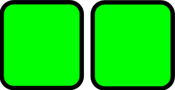

.. ==================================================
.. FOR YOUR INFORMATION
.. --------------------------------------------------
.. -*- coding: utf-8 -*- with BOM.

.. ==================================================
.. DEFINE SOME TEXTROLES
.. --------------------------------------------------
.. role::   underline
.. role::   typoscript(code)
.. role::   ts(typoscript)
   :class:  typoscript
.. role::   php(code)

Creating layout templates
^^^^^^^^^^^^^^^^^^^^^^^^^

The layout templates usually have to get stored in a Sys-Folder. Either
create a new one or choose an existing one. You could put the layout templates
for example in the same Sys-Folder where you have stored additional TypoScript
template records. The layout templates you create in this storage page will
get shown in a new kb\_nescefe content element container, in the layout template
drop-down selector box, as shown in the section :ref:`ref-usersmanual`.

A layout template simply stores the path to the FE and BE fluid templates
which get used for rendering the containers. By giving an layout template a
speaking name it is easy for your editors to choose an appropriate container.

To create a layout template record use the "Create new record" button in the
Web>List module and create a new record of type "Layout Template". Just
as you would create a news or tt\_address entry.

.. figure:: ../../../Images/screen-7.png
   :alt: Editing a layout template record

When editing the record you have the option to set a name for it –
this name will appear in the "Layout Template" select box in the tab
"Plugin" when editing a content element container as described in the
:ref:`ref-usersmanual`. The two other fields of a layout template record
define the HTML/Fluid templates which get used for displaying the container
in the BE and the FE.

The BE template has to follow some basic rules which is a result of the
styles already integrated into the TYPO3 backend interface. The FE template
on the other hand is completely up to you as site administrator/integrator.
You can either create a simple HTML FE template or a modern template for
some responsive framework like Twitter Bootstrap or Zurb Foundation. The
FE template could be almost anything - even a XML snippet getting rendered
into a RSS feed or a XML office document.

.. tip:: The value of the FE/BE template field has to specify a relative path to the
   template. The syntax "EXT:extensionKey/Path/To/Template.html" can get used
   to specify a template which is provided via some custom extension.

For testing purposes you could use the provided example templates. Of course
you can also use those templates in a production system. But as soon as you want
to make changes to the FE template to match the design of your website it is
recommended to move them out of kb\_nescefe.
Making changes directly in the extension would inhibit an easy upgrade path to
future versions of kb\_nescefe.

The example FE templates
""""""""""""""""""""""""

- **EXT:kb\_nescefe/Resources/Private/Templates/Frontend/TwoColumns.html**
  Simple two column template using a table

- **EXT:kb\_nescefe/Resources/Private/Templates/Frontend/ThreeColumns.html**
  Simple three column template using a table

- **EXT:kb\_nescefe/Resources/Private/Templates/Frontend/ThreeColumnsShowcase.html**
  Showcase three column template using a table with two columns in one row and another row having set colspan=2

- **EXT:kb\_nescefe/Resources/Private/Templates/Bootstrap/TwoColumns\_50-50.html**
  Twitter Bootstrap two column template with 50:50 column width allocation

- **EXT:kb\_nescefe/Resources/Private/Templates/Bootstrap/ThreeColumns\_33-33-33.html**
  Twitter Bootstrap three column template with 3 x 1/3 full width column width allocation

- **EXT:kb\_nescefe/Resources/Private/Templates/Frontend/HorizontalColumns.html**
  Example for a template with a dynamic number of columns. The "section" feature is currently
  not implemented so this example should not get used at the moment.

The example BE templates
""""""""""""""""""""""""

- **EXT:kb\_nescefe/Resources/Private/Templates/Backend/TwoColumns.html**
  Simple two column template for the backend

- **EXT:kb\_nescefe/Resources/Private/Templates/Backend/ThreeColumns.html**
  Simple three column template for the backend

- **EXT:kb\_nescefe/Resources/Private/Templates/Backend/ThreeColumnsShowcase.html**
  Showcase three column template using a table with two columns in one row and another row having set colspan=2

- **EXT:kb\_nescefe/Resources/Private/Templates/Backend/HorizontalColumns.html**
  Example for a backend template with a dynamic number of columns. The "section" feature is currently
  not implemented so this example should not get used at the moment but it shows the intention.

.. tip:: When creating a new layout template record the "Two columns" template is
   configured by default. So just leave the default values filled in when you want
   to make your first tests.

Of course you can set it to something like
"fileadmin/mytemplates/clever\_design.html" to use your own templates right from
the beginning. (Don't take "clever\_design" as a counterpart or substitute for
"intelligent\_design" :)

