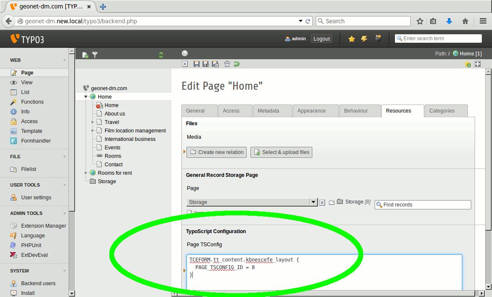



.. ==================================================
.. FOR YOUR INFORMATION
.. --------------------------------------------------
.. -*- coding: utf-8 -*- with BOM.

.. ==================================================
.. DEFINE SOME TEXTROLES
.. --------------------------------------------------
.. role::   underline
.. role::   typoscript(code)
.. role::   ts(typoscript)
   :class:  typoscript
.. role::   php(code)

Setting up the layout template folder
^^^^^^^^^^^^^^^^^^^^^^^^^^^^^^^^^^^^^

Now when you have created some layout templates the TYPO3 installation
still does not know about this folder. You have to configure this as folder
containing the layout templates you want your editors to select from. If you have
multiple sites in your TYPO3 instance you could have more of those folders each with
different layout templates. To set the location of a layout template
folder for a whole page branch just add lines like the following in the page
TS-Config of the branch root:

.. code-block:: typoscript
   :linenos:

   TCEFORM.tt\_content.kbnescefe\_layout {
     PAGE\_TSCONFIG\_ID = 123
   }

Take care to replace 123 with the matching UID of the sys-folder containing your layout templates.

.. tip:: The page TS-Config gets set in the page header (when editing a page record).
   This is not the TypoScript Template which contains the "Setup" and "Constants" field defining
   the rendering of a page.

