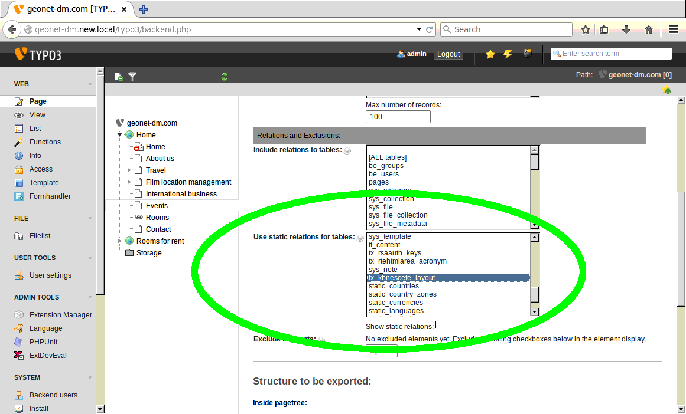
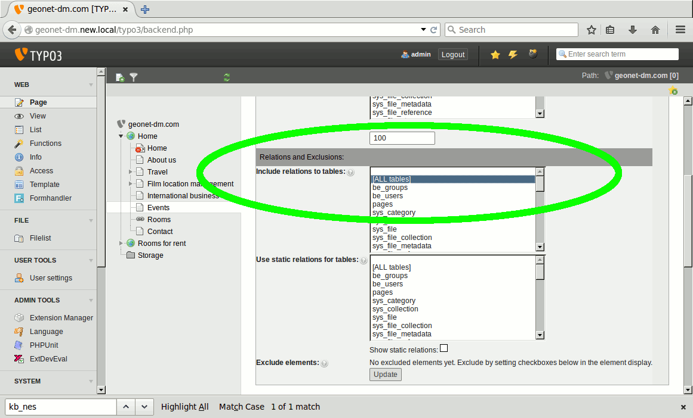
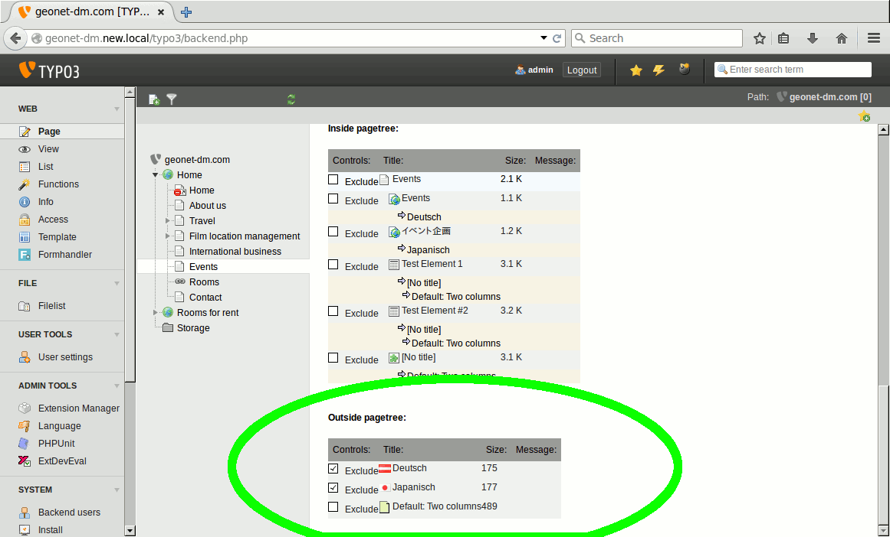
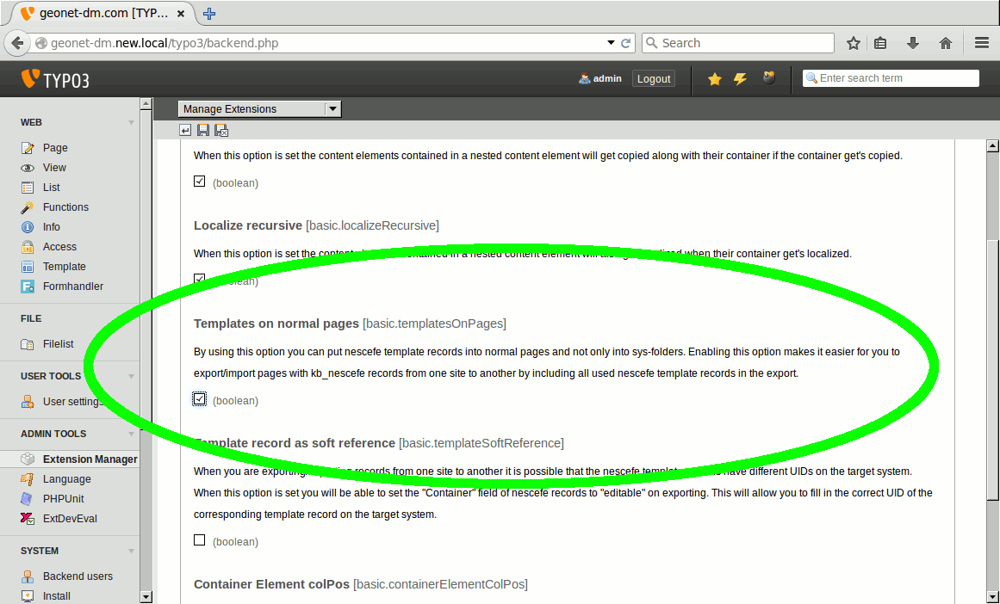
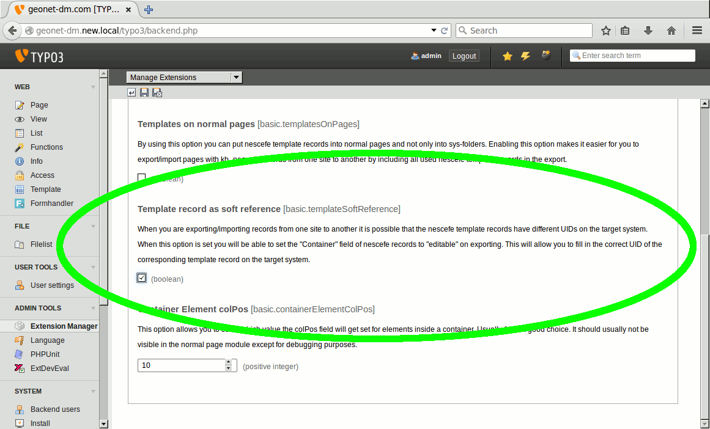
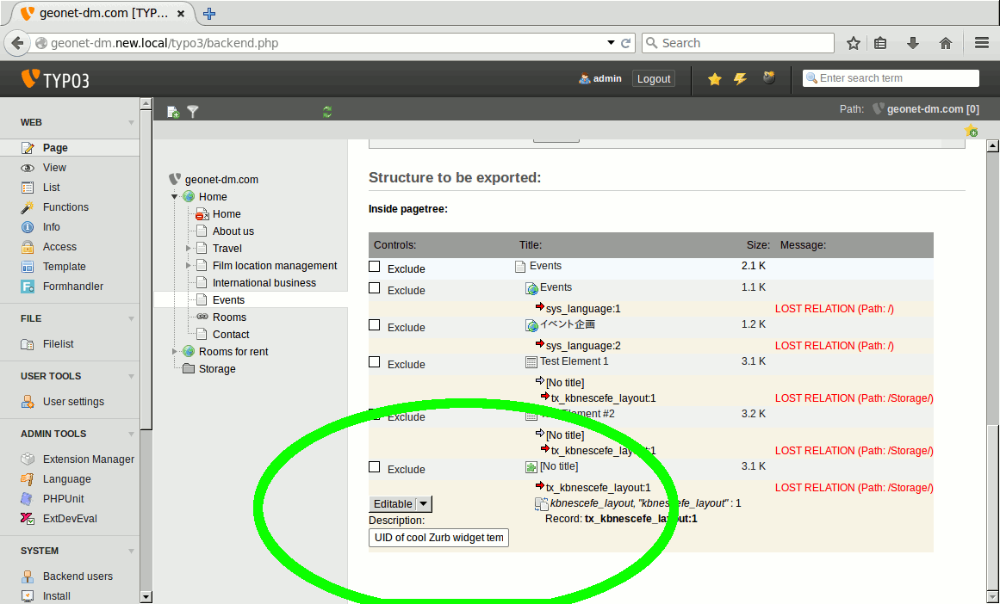
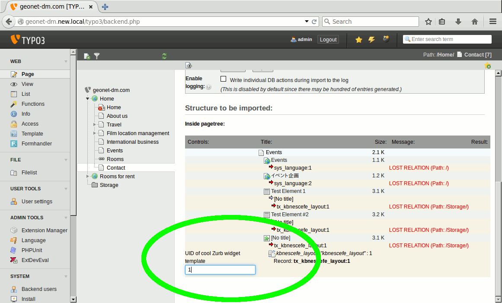


.. ==================================================
.. FOR YOUR INFORMATION
.. --------------------------------------------------
.. -*- coding: utf-8 -*- with BOM.

.. ==================================================
.. DEFINE SOME TEXTROLES
.. --------------------------------------------------
.. role::   underline
.. role::   typoscript(code)
.. role::   ts(typoscript)
   :class:  typoscript
.. role::   php(code)

Import and Export of nescefe elements
^^^^^^^^^^^^^^^^^^^^^^^^^^^^^^^^^^^^^

When you are making exports or imports of pages with kb\_nescefe
elements, or if you are exporting/importing kb\_nescefe elements on
their own you have to consider some special circumstances. It depends
on your requirements which solution is best suited for your case.

Same layout template UIDs on source and target system
"""""""""""""""""""""""""""""""""""""""""""""""""""""

First of all you should notice that template records can usually only
exist on sysfolder pages. So if you are making an export of some
branch of your website the sysfolder the kb\_nescefe layout template
records will eventually not be part of the export. The export module
allows you to make an export with a static reference to the
kb\_nescefe template records. If the **kb\_nescefe templates have the
same UIDs on the source and target system** this is the best choice. You
can achieve this behaviour by marking the table "kb\_nescefe\_layout"
in the export mask field "Use static relations for tables" (Tab "Configuration").

Include layout template records in export
"""""""""""""""""""""""""""""""""""""""""

If you want to transfer the kb\_nescefe layout templates to the target
system along with the exported records you should not mark the table "tx\_kbnescefe\_layout"
in the "Use static relations for tables" field but instead mark the table in the
"Include relations to tables" field (Or just mark the "[ALL tables]" option).

Then press the "Update" button and have a look at the bottom of your structure going to be exported.

There you should see an area labeled "Outside pagetree". In this section you will see all records which
are now (Because of the "Include relations to tables" setting) going to
be included in the export. They are shown in the "Outside pagetree" section because they
are not in the currently exported page tree branch.
They get referenced from within some of the exported records. Just make sure
the **"Exclude"** checkbox is **not set** for the 
kb\_nescefe layout templates so those records **get included** in the export.

In the case you are making such an export with the layout template records included
you'll have to verify that the extension option "Templates on normal pages" is set
via the extension manager on the target system. This allows kb\_nescefe template
records to exist on normal pages.

The sysfolder where those "Outside pagetree" elements reside will not get included in
the export - so TYPO3 will put those "orphan" records on the root page of your
exported branch. If the "Templates on normal pages" extension configuration option
is not set those records would get dropped upon import: TYPO3 wants to put them onto
the export branch root page but can't because those records wouldn't be allowed there, on
a normal page.

Using soft references
"""""""""""""""""""""

The last option you have for taking care of layout template records is to
manually define which layout template will get used on the target system for each
kb\_nescefe content element container. This option makes sense if you have
already transfered the layout template records to the target system but if they
have different UIDs on the source and target system. You can enable this type
of export by activating the "Template record as soft reference" option in the
extension manager configuration of the kb\_nescefe extension on both: target and
source system.

Now make an export of a page branch again while this extension manager option 
is active. You will now get a Drop-Down for each layout template selected in
a kb\_nescefe content element container. In this drop down you can choose between
the options "Exclude" or "Editable". By default if no selection is made the option
"Exclude" will be chosen. After choosing "Editable" press the button "Update" of
the export "Configuration" form/tab again. You can now fill in a label/remark for each
editable field. Here you can write down a sentence like
"Fill in the UID of the three column template" so the person who makes the import
on the target system has a clue which UID to fill in for each layout template relation.

If you select the "Editable" option and make the export the layout template will
also not get included in the export. But when importing this file on the target
system you have an input field for every "Editable" layout template reference in a
kb\_nescefe container element.
In this field you can fill in the UID of the corresponding layout template record
of the target system which should get used for this container.

