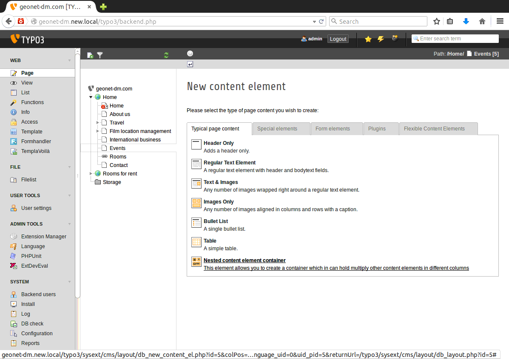
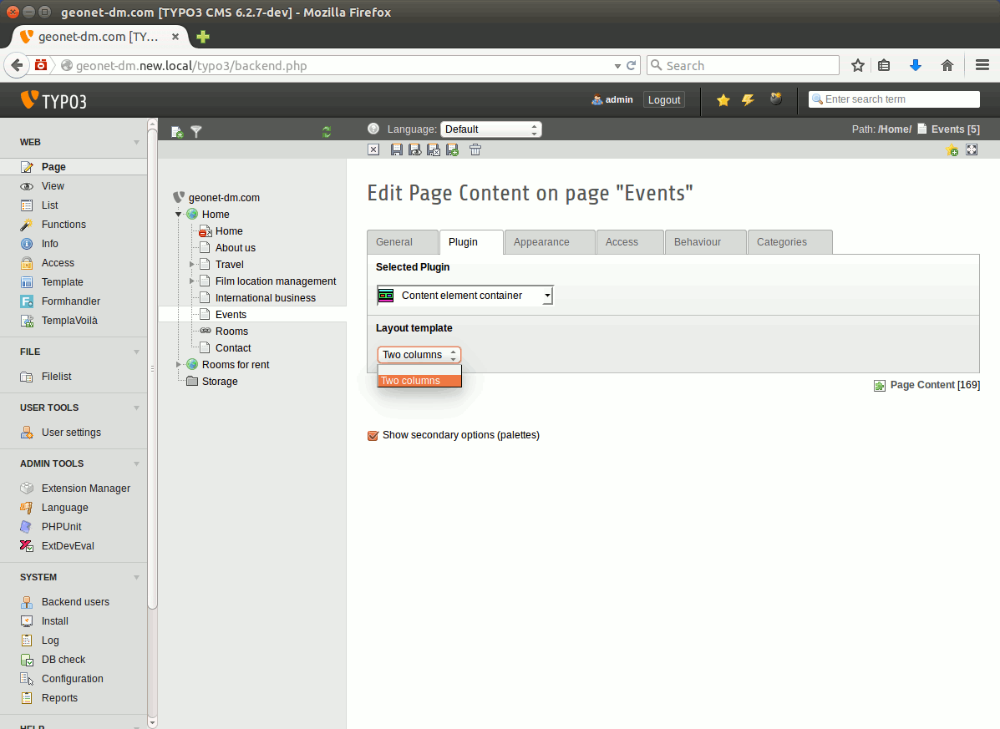
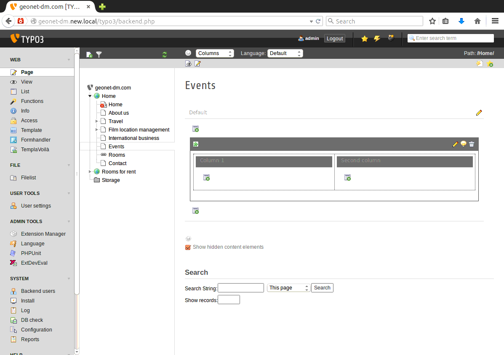
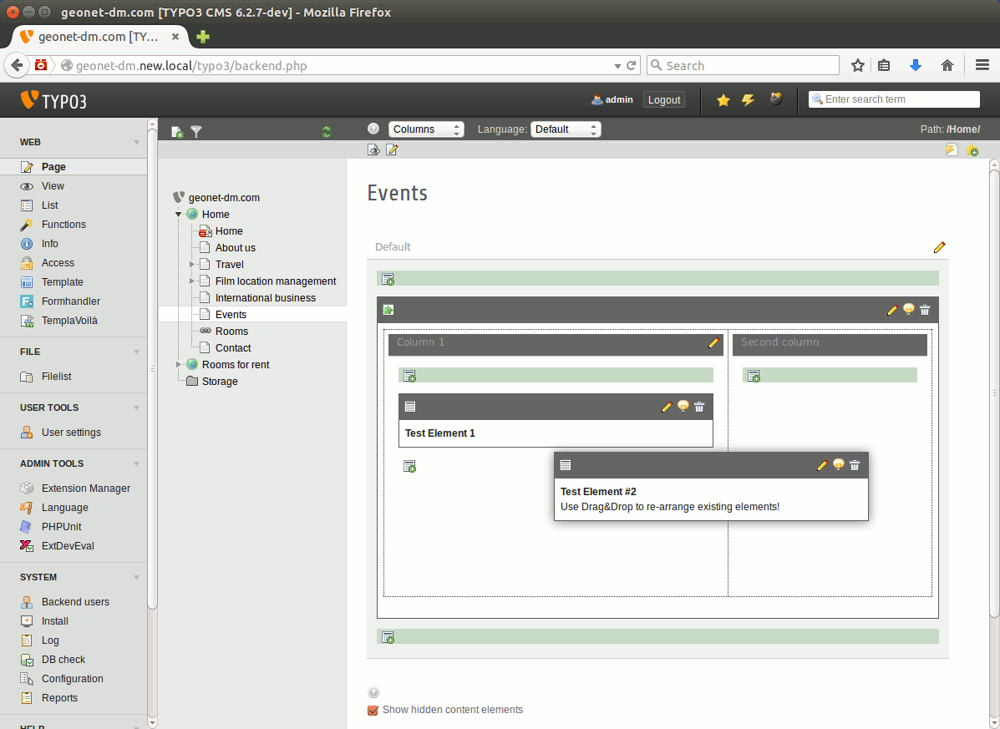



.. ==================================================
.. FOR YOUR INFORMATION
.. --------------------------------------------------
.. -*- coding: utf-8 -*- with BOM.

.. ==================================================
.. DEFINE SOME TEXTROLES
.. --------------------------------------------------
.. role::   underline
.. role::   typoscript(code)
.. role::   ts(typoscript)
   :class:  typoscript
.. role::   php(code)

.. _ref-usersmanual:

Users manual
------------

When your site administrator has set up the extension correctly you should
be able to simply insert a new content element (see :ref:`TYPO3 editors guide <t3editors:content-working>`) of type
"Nested content element container" into any column of your page. You can create a new nested content element
by using the "New Content Element wizard" by just clicking on the "Add a new record" button 
in the Web>Page module.

Of course advanced users can also change any existing content element to become a
nested content element container by switching the
type of the content element from "Text" or "Text with Image" to "Plugin" and
then select "Nested content element container" as plugin type.

When you have created a new container element or changed an existing content element
you will have to define which "Layout template" shall get used. This layout template
has to get configured and integrated into your TYPO3 instance by your administrator before.
If this task is also up to you continue to read the section :ref:`ref-configuration` of this manual.

If there are any layout templates available they will be shown in the field "Layout template"
on the tab "Plugin" and you can select the desired one:

Now "Save & Exit" the content element container and return to the Web>Page module.

You should now see a content element which can act as a container for other content
elements with areas that look like your TYPO3 adminstrator/integrator has intended it.
Or at least it should be this way ;)

The columns inside the content element will present you a "New content element" button
just like the one you know from the normal content columns Left, Normal, Right, Border a.s.o.
You can use this button to create new content elements inside the container or can copy&paste
already existing content elements into the container. For pasting elements into an empty column
use the paste button in the column header. For pasting elements after another element use the
Context menu (In the TYPO3 world also known as "Clickmenu").

It goes without saying that also drag&drop works to move elements into the columns of the
container or to rearrange elements inside a container column.

.. hint:: There is an "easter egg" joke hidden in kb\_nescefe! If you want to find out,
   just try to create a new nested content element during the easter week! Have fun!

Variable column templates
"""""""""""""""""""""""""

Previous versions of kb\_nescefe supported a feature called "Sections". These
sections allowed to have a dynamic number of columns. For each container element
you could simply add an additional column by the click of a button.

This feature is not supported by this new version of kb\_nescefe as looks like it
was rarely used. If you need that feature again feel free to contact the extension
author and support the reimplementation.

.. toctree::
   :maxdepth: 5
   :titlesonly:
   :glob:

   ImportAndExportOfNescefeElements/Index

